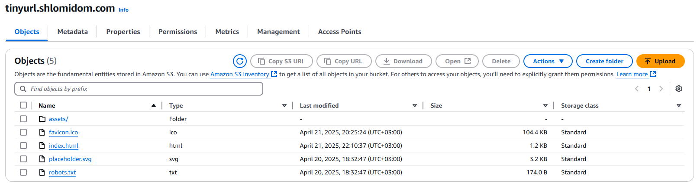

# URL Shortener Frontend

URL Shortener is a serverless AWS application that allows you to shorten URLs. It is built using React, AWS Lambda, RDS (MySQL), and S3. The frontend is statically hosted on S3 bucket and the backend is built using AWS Lambda and MySQL. The application uses AWS API Gateway to expose the Lambda functions as REST APIs.

Install dependencies: `npm install`. Run: `npm run dev`. Deploy to S3: `npm run deploy`


- [URL Shortener Frontend](#url-shortener-frontend)
  - [Frontend](#frontend)
  - [Database](#database)
  - [Generating Short URLs](#generating-short-urls)
  - [Backend](#backend)
  - [Redirection](#redirection)
  - [URLs and DNS Records](#urls-and-dns-records)
  - [API Testing](#api-testing)
  - [S3 Bucket](#s3-bucket)
  - [API Gateway](#api-gateway)
  - [Monitoring \& Logging](#monitoring--logging)
  - [Throttling](#throttling)

## Frontend

The frontend is a simple React application that allows users to enter a URL and get a shortened URL. The frontend is built using React, TypeScript, and Tailwind CSS. The application is statically hosted on S3 bucket, called 'tinyurl.shlomidom.com'.

I'll be honest, I used [Loveable](https://lovable.dev/) website to quickly generate a simple React app. I then edited it to match my needs.

## Database


The MySQL database, hosted on AWS, has a single table: `short_urls`. The table has the following columns:

- `short_code`: The primary key of the table, auto-incremented, integer. We use this to generate a short URL. Example: `1`, `2`, `3`, etc.
- `long_url`: The long URL that we want to shorten. Example: `https://www.example.com/long-url`, etc.
- `short_url`: The short URL that is generated by the application. Example: `a123GzH`.
- `hits`: The number of times the short URL has been accessed. When the user clicks on the short URL (for instance `https://tinyurl.shlomidom.com/?u=a123GzH`), the hits are incremented by 1.
- `created_at`: The date and time when the short URL was created. This is an auto-generated field that is set by the database when the row was created.
- `expiry_at`: The expiration date of the URL in UTC. This is an optional field that can be set by the user. If the URL is expired, it will not be returned by the API.

## Generating Short URLs

This is a simple strategy. First we get the `short_code` (integer) and then we use Base62 encoding to convert the integer to a string. The Base 62 encoding uses the following characters:

- `0-9`: 10 characters
- `a-z`: 26 characters
- `A-Z`: 26 characters
- Total: 62 characters

The entire code for this in the lambda function is:

```python
# Shorten URL given short_code (uses base62 counter)
def shorten_url(short_code):
    print("Shortening URL with short_code:", short_code)
    base62_alphabet = "0123456789abcdefghijklmnopqrstuvwxyzABCDEFGHIJKLMNOPQRSTUVWXYZ"

    # Edge case
    if short_code == 0:
        return base62_alphabet[0]
    
    # Base 62 encoding
    base62 = []
    while short_code > 0:
        short_code, rem = divmod(short_code, 62)
        base62.append(base62_alphabet[rem])
    
    return ''.join(reversed(base62))
```

## Backend

The backend uses AWS API Gateway to expose the Lambda functions as REST APIs. The API Gateway is configured to use the following routes:

- `/api`: This route is used to shorten URLs. It accepts both GET and POST methods.

Two lambda functions:

- `shorten_GET`: This function takes a short URL and returns a long URL, if it exists in the database and the URL is not expired (optionally URLs can expire, set by the user). It is triggered by API Gateway GET method on '/api' route.
- `shorten_POST`: This function takes a long URL and expiration and returns a short URL. It is triggered by API Gateway POST method on '/api' route. We do not check if the long URL exists in the database, which simplifies operations. It generates a new short URL and stores it in the database. After inserting new row, we take the `short_code` we get from the database and update the table, setting `short_url` to the generated short URL.

Both methods check for valid URLs and expiration date (we can't shorten URL with past expiration date).

Although the function name is `shorten_POST` I accidentally called it `shorten_PUT` and never changed it. The function is actually a POST method and not a PUT method. Maybe I'll change it in the future.

## Redirection

When we get a short URL, for example `https://tinyurl.shlomidom.com/?u=a123GzH`, the front-end JS checks for the URL parameter `u`. If it exists, we call the API Gateway GET method to get the long URL. If the long URL exists, we redirect the user to the long URL: `window.location.href = longUrl;`. If the long URL does not exist, we show an error message.

## URLs and DNS Records

I use [Spaceship](https://www.spaceship.com/) domain manager. I bought the `shlomidom.com` domain, so I can also use subdomain `tinyurl`.

We have multiple URLs we need to juggle with:

- The S3 bucket, because we statically host the site we get **bucket website endpoint**: `http://tinyurl.shlomidom.com.s3-website-us-east-1.amazonaws.com`. In the DNS records we create a CNAME record with key: `tinyurl.shlomidom.com` and value is this endpoint.
- However, later I added certificate to the bucket, so we need to use **cloudfront distribution**. The distribution URL is `https://d284fsyztcgs94.cloudfront.net`. In the DNS records we replace the CNAME `tinyurl.shlomidom.com` with the distribution URL. This way we can use HTTPS and have a valid certificate for the domain.
- I also had to DNS validate my authority to the domain `tinyurl.shlomidom.com` so I had to add another CNAME record, according to `AWS Certificate Manager`, with key: `_86580f26949ed195935a6991e36bd2aa.tinyurl.shlomidom.com` and value: `_9376d421565fb0a95c1be05fada4b1c4.xlfgrmvvlj.acm-validations.aws`.


- I have an API gateway with the following endpoint URL: `https://h3zlwgw9qa.execute-api.us-east-1.amazonaws.com`. I use this in my front-end code to call the APIs that I need.

To summarize, I only need to deal with 2 URLs:

- `https://tinyurl.shlomidom.com`: The URL of the site, which points to the S3 bucket with Cloudfront distribution.
- `https://h3zlwgw9qa.execute-api.us-east-1.amazonaws.com`: The URL of the API Gateway, which points to the Lambda functions.

## API Testing


A simple Postman collection is run to test the API. I test GET and POST requests with multiple conditions. Not really complex.

Example test:

```javascript
pm.test("", function () {
    const jsonData = pm.response.json();

    pm.expect(jsonData).to.have.property("statusCode", 200);
    pm.expect(jsonData).to.have.property("short_url");
    pm.expect(jsonData.short_url).to.not.be.empty;
});
```

## S3 Bucket

The site is stored in an S3 bucket.




I upload my site using the command `npm run deploy`, which builds the site (`npm run build`) and uploads it to the S3 bucket (`aws s3 sync ./dist s3://tinyurl.shlomidom.com --delete`). The bucket is configured to be publicly accessible and to serve static files. The upload is only possible for me, because you need to configure AWS CLI with account ID and account key, which only I have.

## API Gateway

I had to configure the CORS (Cross-Origin Resource Sharing) to allow different domains to access the API.


## Monitoring & Logging

I use AWS CloudWatch to monitor the Lambda functions and API Gateway. I can see the logs of the functions and the API calls.

I have 4 log groups, three for each of the lambda functions (the OPTIONS lambda function is not used, only for testing):


Example log from `shorten_GET` lambda function:


## Throttling

In order to prevent high costs from AWS, I added throttling to the API Gateway. The burst limit is 10, and rate limit is 5.


In order to test this, I ran a simple python script that sends 100 requests to the API Gateway and we check how many requests are successful and how many are throttled.

```python
import requests
import concurrent.futures

API_URL = "https://h3zlwgw9qa.execute-api.us-east-1.amazonaws.com/api"

def send_request(i):
    try:
        response = requests.get(API_URL, params={"short_url": "A"}, timeout=5)
        print(f"[{i}] Status: {response.status_code}, Response: {response.text[:50]}")
    except requests.exceptions.RequestException as e:
        print(f"[{i}] Request failed: {e}")

def stress_test_parallel_requests(n=100):
    with concurrent.futures.ThreadPoolExecutor(max_workers=100) as executor:
        futures = [executor.submit(send_request, i) for i in range(n)]
        concurrent.futures.wait(futures)

if __name__ == "__main__":
    stress_test_parallel_requests()
```

We can see only 10 requests are passed:


